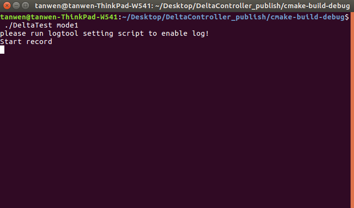
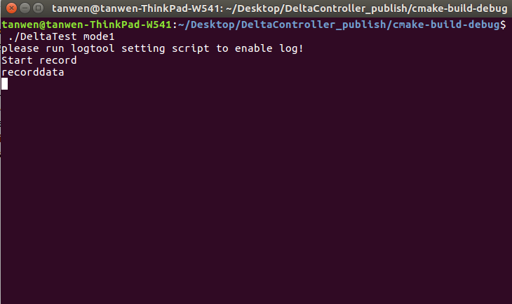
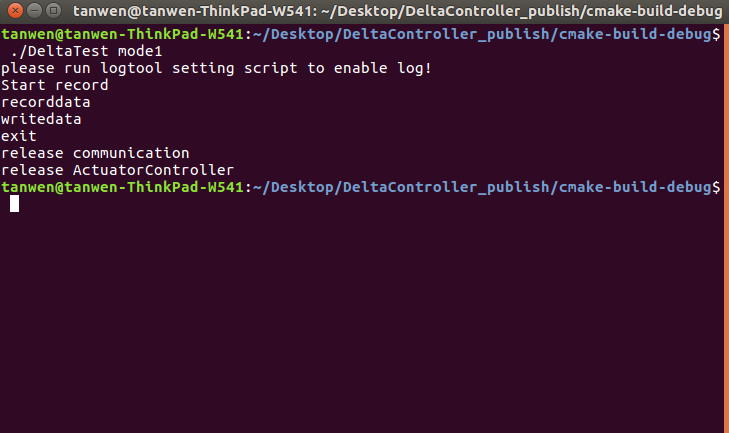
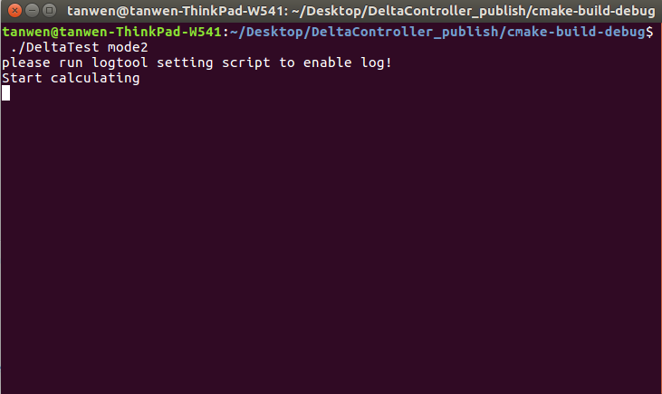
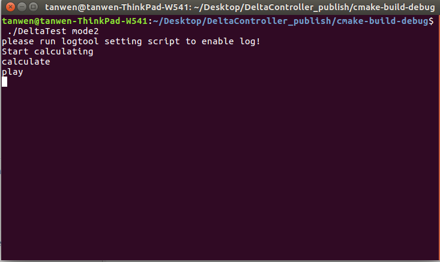
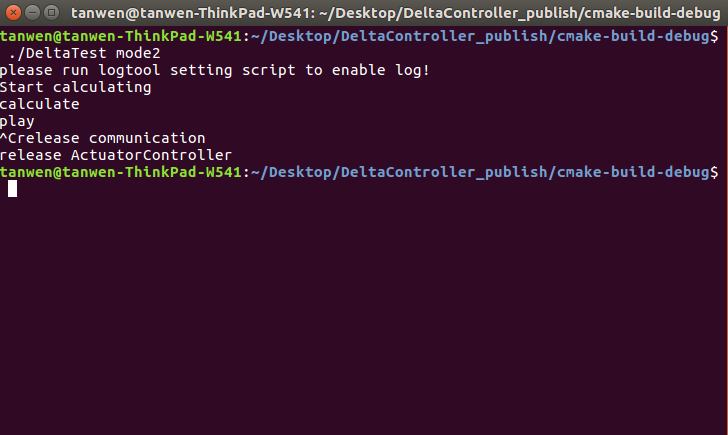

# innfos-delta-robot-controller

Delta软件安装与使用
本说明书是针对Delta并联机器人使用说明.
在使用之前请仔细阅读本说明书内容 .
Delta采用了并联结构,具有刚度大,承载能力强等优点,所有关节采用QDD Lite系列执行器搭建.同时,因QDD Lite系列执行器采用了复合材料，大大降低了高端机器人本机研发成本,主要应用于物流的包装分拣搬运,研究所实验室的研究等领域.

软件安装与使用
IAS软件的使用
      IAS(INNFOS Actuator Studio)的为配置机械臂的上位机软件 , 请访问INNFOS Actuator Studio(IAS)说明.
运动功能使用
示教-再现功能

下载安装
运行环境：linux-x86-64
访问该链接下载机械臂软件或者直接执行以下命令

访问该链接download link下载SDK相关文件或者直接执行以下命令
$ git clone https://github.com/innfos/innfos-cpp-sdk.git
访问该链接download link下载Delta 机器人相关文件或者直接执行以下命令
$ git clone https://github.com/innfos/innfos-delta-robot-controller

运行模式
Delta并联机器人提供以下运行模式:mode1,mode2
配置环境变量:
(1)$ . environment
Note:每次打开终端都需执行此命令,如不执行,终端会提示找不到动态库”libActuatorController.so”
(2)执行以下命令更改权限：
$ chmod +x DeltaTest
mode1:记录保存示教的点
执行命令
(1)在终端中执行./DeltaTest mode1
此时终端会显示：

(2)在终端中执行recorddata(每记录一个点执行一次该命令)
此时终端会显示：

(3)在终端中执行writedata(记录完所有的点后保存记录的点,只需执行一次)
此时终端会显示：

(4)在终端中执行exit(退出mode1)
此时终端会显示：

注意事项:1.打开文件夹下记录数据的文本Data_linearCurve_Joint,文本中记录的为所有示教的点,这时候需要把第一行的数据复制到结尾,这样可以形成循环播放.

mode2:执行示教动作
(1)在终端中执行./DeltaTest mode2
此时终端会显示：

(2)在终端中执行calculate(末端计算插值点)
此时终端会显示:

(3)在终端中执行play(播放示教的轨迹)
此时终端会显示:

(4)在终端中执行ctrl+c(结束退出)
此时终端会显示:

注意事项:如果想执行之前示教好的点,不需要执行mode1,直接执行mode2即可.
